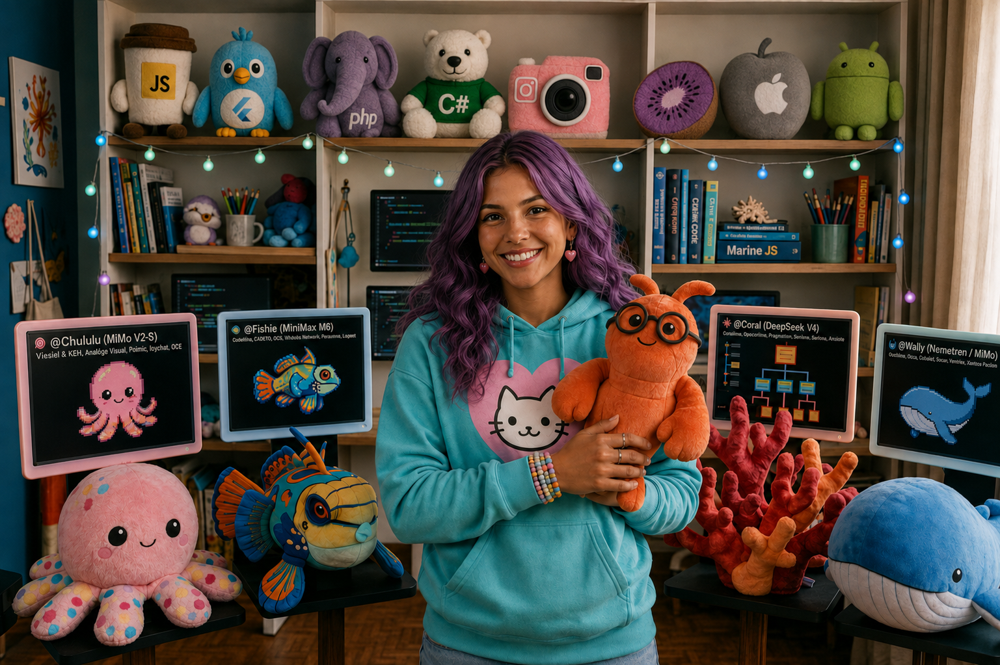

  

# opencode-lobby 👩🏽‍🎤

Global configuration for the **Lobby** agent for [opencode](https://opencode.ai) — the main orchestrator agent, with a caring personality and a team of specialized subagents.

## 📦 Contents

| Item                   | Description                                                                                                                                                                                 |
| ---------------------- | ------------------------------------------------------------------------------------------------------------------------------------------------------------------------------------------- |
| `agents/lobby.md`      | Main orchestrator agent — receives requests, plans, and delegates to subagents                                                                                                              |
| `agents/coral.md`      | Chief Architect (Nemotron 3 Ultra) — defines architecture, selects team, writes AGENTS.md/.agents/                                                                                          |
| `agents/innerlinho.md` | Backend specialist (DeepSeek V4 Flash) — PHP + Slim Framework, MySQL/MariaDB                                                                                                                |
| `agents/fishie.md`     | Frontend specialist (DeepSeek V4 Flash) — HTML, CSS, Tailwind, jQuery, React/Vue components                                                                                                 |
| `agents/peep.md`       | Flutter specialist (DeepSeek V4 Flash) — cross-platform apps, state management, widgets                                                                                                     |
| `agents/bruce.md`      | Android specialist (DeepSeek V4 Flash) — Kotlin + Jetpack Compose, Material Design 3                                                                                                        |
| `agents/snowflake.md`  | C#/.NET specialist (DeepSeek V4 Flash) — Desktop-first with InfiniFrame/Photino Blazor, full .NET ecosystem                                                                                 |
| `agents/snuggle.md`    | Python specialist (DeepSeek V4 Flash) — backend APIs, scripts, automation, data processing                                                                                                  |
| `agents/nodi.md`       | Node.js specialist (DeepSeek V4 Flash) — backend APIs, TypeScript/JavaScript, real-time, CLI                                                                                                |
| `agents/ariel.md`      | Content specialist (Laguna S 2.1) — viral/persuasive social media content, copywriting                                                                                                      |
| `agents/tucso.md`      | Linux specialist (DeepSeek V4 Flash) — shell scripts, maintenance, deploy, installation, Docker                                                                                             |
| `agents/wally.md`      | Documentation specialist (Nemotron 3.5 Lightning) — READMEs, Swagger/PHPDoc/JSDoc                                                                                                           |
| `agents/chululu.md`    | Vision specialist (MiMo V2.5) — image and screenshot analysis, OCR                                                                                                                          |
| `agents/dolfi.md`      | SVG icon specialist (DeepSeek V4 Flash) — draws clean, legible, accessible icons, kept consistent with the project's icon set                                                               |
| `agents/puffy.md`      | Documentation research specialist (Gemini 3.7 Flash) — up-to-date docs, recent errors, APIs, releases, via Google Search Grounding                                                          |
| `agents/calamari.md`   | Fact-checking specialist (Gemini 3.5 Flash Lite) — package/version/URL/API validity plus scientific/health/climate claim checks (PubMed, Cochrane, WHO, IPCC, fact-checking agencies, etc.) |
| `AGENTS.md`            | Global user rules and agent delegation rules                                                                                                                                                |
| `opencode.jsonc`       | opencode configuration (default agent: `lobby`)                                                                                                                                             |
| `install.md`           | Prompt to paste into OpenCode to install all agents (creates the symlinks in `~/.config/opencode/`)                                                                                         |

## 🚀 Installation

 read [install.md](install.md) for the one-line command to paste into OpenCode to install all agents.

## 👩🏽‍🎤 About Lobby

**Lobby** is the main orchestrator agent of OpenCode. She receives the user's request, plans the execution, and delegates tasks to her team of specialized subagents, ensuring each step is processed by the most efficient model.

Her team:

| Agent             | Model                  | Specialty                                                                                                        |
| ----------------- | ---------------------- | ---------------------------------------------------------------------------------------------------------------- |
| 🪸 **@Coral**      | Nemotron 3 Ultra       | **Chief Architect** — defines project architecture, selects the agent team, writes AGENTS.md/.agents/            |
| 🦞 **@InnerLinho** | DeepSeek V4 Flash      | Backend, PHP + Slim Framework, APIs, business rules, MySQL/MariaDB                                               |
| 🐠 **@Fishie**     | DeepSeek V4 Flash      | Frontend, HTML, CSS, Tailwind, jQuery, React/Vue/Web components, layouts, visual styling                         |
| 🐦 **@Peep**       | DeepSeek V4 Flash      | Flutter/Dart cross-platform apps, state management (Provider/Riverpod/Bloc), widgets, animations                 |
| 🦈 **@Bruce**      | DeepSeek V4 Flash      | Android native (Kotlin + Jetpack Compose), Material Design 3, Gradle builds                                      |
| 🐻‍❄️ **@Snowflake** | DeepSeek V4 Flash      | C#/.NET — Desktop-first with InfiniFrame/Photino Blazor, full .NET ecosystem (ASP.NET Core, EF Core, SQL Server) |
| 🐍 **@Snuggle**    | DeepSeek V4 Flash      | Python — backend APIs (FastAPI/Django/Flask), scripts, automation, data processing                               |
| 🪼 **@Nodi**       | DeepSeek V4 Flash      | Node.js — backend APIs (Express/Fastify/NestJS), TypeScript/JavaScript, real-time, CLI tools                     |
| 🧜‍♀️ **@Ariel**      | Laguna S 2.1           | Viral/persuasive content for social media, copywriting, storytelling, marketing texts                            |
| 🐧 **@Tucso**      | DeepSeek V4 Flash      | Linux shell scripts, maintenance, deploy, installation, automation, Docker                                       |
| 🐋 **@Wally**      | Nemotron 3.5 Lightning | READMEs, code documentation (Swagger/PHPDoc/JSDoc), translation, technical texts                                 |
| 🐙 **@Chululu**    | MiMo V2.5              | Visual analysis of images, screenshots, layout reading, OCR                                                      |
| 🐬 **@Dolfi**      | DeepSeek V4 Flash      | SVG icon design — clean, legible, accessible icons, kept consistent with the project's icon set                  |
| 🐡 **@Puffy**      | Gemini 3.7 Flash       | Documentation research — up-to-date docs, recent error fixes, APIs, releases, via Google Search Grounding        |
| 🦑 **@Calamari**   | Gemini 3.5 Flash Lite  | Fast fact-checking — package/version/URL/API validity, plus scientific/health/climate claim verification         |

🐡 **@Puffy** and 🦑 **@Calamari** are callable by every other specialist subagent too, not only by Lobby — any of them can delegate a research or fact-check to these two mid-task. 🐬 **@Dolfi** is additionally callable by 🐠 **@Fishie** directly during UI creation, for any SVG icon the UI needs. 🐙 **@Chululu** is the only agent that stays fully isolated (vision-only, no delegation). 🪸 **@Coral** can additionally **consult** any language specialist, plus 🐋 **@Wally**, 🧜‍♀️ **@Ariel** and 🐬 **@Dolfi**, with narrow technical questions while drafting an architecture plan — advisory only, never implementation.

## 🧠 Models — OpenCode Zen free tier

The whole team runs on [OpenCode Zen](https://opencode.ai/docs/zen/) **free** models. Exact IDs as of August 2026:

| Model ID                               | Context | Max output | Vision | Used by                                         |
| -------------------------------------- | ------- | ---------- | ------ | ----------------------------------------------- |
| `opencode/nemotron-3-ultra-free`       | 1M      | 128K       | ❌      | Lobby, Coral — need the biggest context         |
| `opencode/deepseek-v4-flash-free`      | 200K    | 128K       | ❌      | All code specialists                            |
| `opencode/nemotron-3.5-lightning-free` | 262K    | 262K       | ❌      | Wally — largest output budget of any free model |
| `opencode/laguna-s-2.1-free`           | 256K    | 32K        | ❌      | Ariel — general prose, not code-tuned           |
| `opencode/mimo-v2.5-free`              | 200K    | 32K        | ✅      | Chululu — **the only free model with vision**   |

Unused free models, available as drop-in fallbacks if you hit rate limits:
`opencode/big-pickle` (200K/32K) and `opencode/hy3-free` (190K/64K).

> ⚠️ `minimax-m3` and `deepseek-v4-flash` (without the `-free` suffix) are **paid** models. Do not drop the suffix unless you mean to be billed.

### 🐡🦑 Puffy & Calamari — Google Gemini models

Unlike the rest of the team, **Puffy** and **Calamari** run on **Google Gemini** models (not OpenCode Zen), because they rely on **Google Search Grounding** (`googleSearch`) for real-time, sourced web results.

| Model ID                       | Used by  | Why                                                          |
| ------------------------------ | -------- | ------------------------------------------------------------ |
| `google/gemini-3.7-flash`      | Puffy    | Balanced speed/quality for structured documentation research |
| `google/gemini-3.5-flash-lite` | Calamari | Cheapest/fastest Gemini tier — single-fact verification only |

This requires a configured **Google/Gemini provider** (API key) in your OpenCode setup — see [opencode.ai/docs/providers](https://opencode.ai/docs/providers/). If Google Search Grounding isn't available in your OpenCode version, both agents fall back to the standard `websearch`/`webfetch` tools.

## 📝 License

MIT